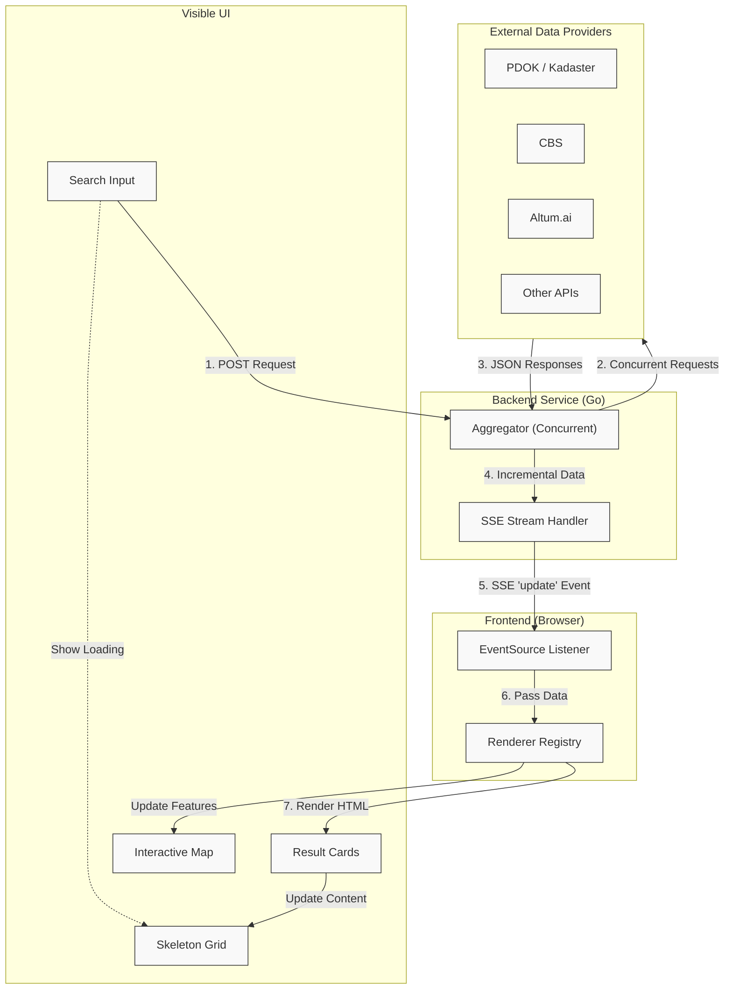

# AddressIQ

AddressIQ is a property intelligence toolkit for the Netherlands: it looks up an address, enriches it with cadastral, demographic, environmental and market data from external APIs, and returns a consolidated property profile and investment/ESG scores. Target audience: developers building property tools, data engineers, and product teams who need fast, reusable property-level insights.

## Table of Contents

- [Quick start](#quick-start)
- [Project structure](#project-structure)
- [API reference](#api-reference)
- [Deployment](#deployment)
- [Privacy Disclaimer](#privacy-disclaimer)
- [Licensing](#licensing)
- [Next Steps](#next-steps)

## Quick start

1. Install prerequisites:

   - Docker & Docker Compose
   - Go 1.21+ (for local development)
2. Copy `.env.example` to `.env` and add your API keys
3. Start the application:

   - **Windows**: `start_localwebapp.bat`
   - **macOS**: `start_localwebapp.command`
   - **Linux**: `start_localwebapp.sh`
4. Stop the application:

   - **Windows**: `end_localwebapp.bat`
   - **macOS**: `end_localwebapp.command`
   - **Linux**: `end_localwebapp.sh`


## Project structure

```text
AddressIQ/
├── backend/
│   ├── pkg/
│   │   ├── aggregator/      # Data aggregation service
│   │   ├── apiclient/       # 35+ API client implementations
│   │   ├── cache/           # Redis caching layer
│   │   ├── config/          # Environment configuration
│   │   ├── handlers/        # HTTP request handlers
│   │   ├── models/          # Data models
│   │   ├── routes/          # API routing
│   │   ├── scoring/         # ESG/Profit/Opportunity scoring engine
│   │   └── tests/           # Integration tests
│   ├── Dockerfile
│   ├── go.mod
│   └── main.go
├── frontend/
│   ├── static/
│   │   ├── css/             # Compiled CSS output
│   │   ├── js/              # JavaScript modules
│   │   ├── icons/           # App icons
│   │   └── scss/            # SCSS source files
│   │       ├── abstracts/   # Variables, mixins
│   │       ├── base/        # Reset, typography
│   │       ├── components/  # UI components
│   │       ├── layout/      # Sidebar, structure
│   │       └── main.scss    # Entry point
│   ├── templates/           # HTML templates
│   └── index.html
├── docs/                    # API references, deployment guides
├── scripts/                 # Utility scripts (build hash, etc.)
├── docker-compose.local.yml
├── .env.example
├── start_localwebapp.*      # Platform-specific startup scripts (includes SCSS compilation)
└── end_localwebapp.*        # Platform-specific shutdown scripts
```

## Information Flow

The application uses a streaming architecture to provide immediate feedback.




## API reference

The project integrates many APIs; see `docs/APIs.md` for the canonical list. Key **gated APIs** (require registration or paid access): Kadaster Objectinformatie, Altum (WOZ/Transactions), Matrixian, KNMI (some datasets), EP-Online (energielabel), NDW, SkyGeo, Schiphol.

| API | Provider | Key? | Price | Datasets | Docs |
| --- | -------- | ---- | ----- | -------- | ---- |
| **AHN Height Model** | PDOK | No | Free | Elevation data, terrain slope, flood risk, view potential | [PDOK](https://www.pdok.nl) |
| **Amsterdam Monumenten** | Amsterdam Municipality | No | Free | Monument status, type (Rijksmonument, gemeentelijk), designation date | |
| **BRO Soil Map** | PDOK / BRO | No | Free | Soil types, peat composition, foundation quality, groundwater depth | [BRO Soil Map](https://www.dinoloket.nl/en/bro-soil-map) |
| **CBS OData** | CBS | No | Free | Neighbourhood statistics, socioeconomic data, income, employment | [CBS Open Data](https://opendata.cbs.nl/) |
| **CBS Population Grid** | CBS | No | Free | Grid-based population data, age distribution, household statistics | [CBS Open Data](https://opendata.cbs.nl/) |
| **CBS Square Statistics** | CBS | No | Free | 100×100m microgrid demographics, hyperlocal population data | [CBS Open Data](https://opendata.cbs.nl/) |
| **CBS StatLine** | CBS | No | Free | Comprehensive municipal statistics via OData, income, education | [CBS Open Data](https://opendata.cbs.nl/) |
| **Education Facilities** | PDOK | No | Free | School locations, quality ratings, distance, capacity, denomination | |
| **Facilities & Amenities** | PDOK | No | Free | Retail, healthcare, services proximity, walk/drive times | |
| **Flood Risk** | Rijkswaterstaat / PDOK | No | Free | Flood zones, dike quality, water levels, flood exposure scoring | [Rijkswaterstaat](https://www.rijkswaterstaat.nl) |
| **Geluidregister WFS** | Geluidregister / RIVM | No | Free | Environmental noise levels from road, rail, air traffic (deprecated) | [Geluidregister](https://www.geluidregister.nl) |
| **Green Spaces** | PDOK | No | Free | Parks, green areas, tree canopy cover, proximity, facilities | |
| **Land Use & Zoning** | PDOK | No | Free | Land use classifications, zoning codes, building rights, future plans | |
| **Luchtmeetnet** | RIVM | No | Free | Real-time air quality (NO2, PM10, PM2.5, O3), AQI, nearest station data | [Luchtmeetnet API](https://api-docs.luchtmeetnet.nl) |
| **Noise Pollution** | RIVM | No | Free | Environmental noise from traffic, industry, rail, aircraft | [Geluidregister](https://www.geluidregister.nl) |
| **Open-Meteo Solar** | KNMI | No | Free | Solar radiation, sunshine duration, UV index for energy potential | [KNMI Data Platform](https://dataplatform.knmi.nl) |
| **Open-Meteo Weather** | KNMI | No | Free | Current weather, precipitation forecasts, hourly/daily weather data | [KNMI Data Platform](https://dataplatform.knmi.nl) |
| **PDOK BAG Locatieserver** | PDOK / Kadaster | No | Free | Address lookup, building & parcel geometry, BAG IDs, coordinates | [PDOK Locatieserver](https://www.pdok.nl/developer/service/locatieserver) |
| **PDOK Platform** | PDOK | No | Free | National spatial data: cadastral layers, AHN elevation, boundaries, WFS/WMS | [PDOK API](https://api.pdok.nl) |
| **PDOK Zoning WFS** | PDOK | No | Free | Zoning plans (deprecated, replaced by Omgevingswet APIs) | |
| **openOV Public Transport** | OpenOV | No | Free | PT stops, schedules, real-time delays, last-mile accessibility | [openOV](https://openov.nl) |
| **NDW Traffic** | NDW | **Yes** | Free+key | Real-time traffic flow (24,000+ locations), congestion, speeds | [NDW Open Data](https://opendata.ndw.nu) |
| **Weerlive Weather** | Weerlive | No | Freemium | 5-day forecasts, current weather conditions (fallback source) | [Weerlive](https://weerlive.nl) |
| **Altum AI Transactions** | Altum.ai | **Yes** | Paid | Historical property transactions (1993-present), market comps, price trends | [Altum Docs](https://docs.altum.ai) |
| **Altum AI WOZ** | Altum.ai | **Yes** | Paid | WOZ valuations, transaction history, building characteristics | [Altum Docs](https://docs.altum.ai) |
| **Altum Energy & Climate** | Altum.ai | **Yes** | Paid | Energy labels (A++++ to G), climate risk, efficiency scores, energy costs | [Altum Docs](https://docs.altum.ai) |
| **Altum Sustainability** | Altum.ai | **Yes** | Paid | Improvement recommendations, CO₂ savings, ROI, payback periods | [Altum Docs](https://docs.altum.ai) |
| **Kadaster Objectinformatie** | Kadaster | **Yes** | Paid | Property ownership, cadastral parcels, official WOZ values, surface areas | [Kadaster Zakelijk](https://www.kadaster.nl/zakelijk) |
| **Matrixian Property Value+** | Matrixian | **Yes** | Paid | Market valuations, comparable sales, automated valuation models (30+ features) | [Matrixian](https://matrixian.com) |
| **Schiphol Flight Noise** | Schiphol | **Yes** | Paid | Flight paths, movements, aviation noise exposure | [Schiphol Developer](https://developer.schiphol.nl) |
| **SkyGeo Subsidence** | SkyGeo | **Yes** | Paid | InSAR-derived land subsidence, ground stability, structural risk | [SkyGeo](https://www.skygeo.com) |
| **Stratopo Environment** | Stratopo | **Yes** | Paid | 700+ environmental variables, pollution index, ESG rating, urbanisation | |
| **CBS Safety Experience** | CBS | **Yes** | Licensed | Crime statistics, safety perception, police response times | |
| **Digital Delta Water Quality** | Digital Delta | **Yes** | Licensed | Water quality, levels, parameters (pH, dissolved oxygen) | |
| **EP-Online Energy Labels** | EP-Online | **Yes** | Licensed | Official Energy Performance Certificates (EPC labels A++++ to G) | [EP-Online](https://www.ep-online.nl/) |
| **Soil Quality** | PDOK | **Yes** | Licensed | Soil contamination levels, contaminants, quality zones, restrictions | |
| **WUR Soil Physicals** | WUR | **Yes** | Agreement | Soil composition, permeability, organic matter, pH, land quality | |
| **Bodemloket Asbestos** | Bodemloket | Varies | Varies | Soil contamination reports, asbestos presence (legacy) | |
| **Building Permits** | PDOK | Varies | Varies | Recent construction activity, permits, development trends | |
| **Parking Availability** | Various Municipalities | Varies | Varies | Parking zones, availability, pricing, occupancy rates | |

For the full table and provider links see `docs/APIs.md`.

## Deployment

### Build Hash Display

The application displays Git commit hashes for both frontend and backend in the top right corner of the UI. These are automatically injected during the build process.

**For Coolify or Docker deployments**, see [COOLIFY_DEPLOYMENT.md](COOLIFY_DEPLOYMENT.md) for detailed configuration instructions.

**Quick summary:**

Backend Dockerfile accepts build arguments:

```bash
docker build \
  --build-arg COMMIT_SHA=$SOURCE_COMMIT \
  --build-arg BUILD_DATE=$(date -u +%Y-%m-%dT%H:%M:%SZ) \
  -f backend/Dockerfile ./backend
```

Backend runtime environment variables (for frontend build info):

```bash
FRONTEND_BUILD_COMMIT=$SOURCE_COMMIT
FRONTEND_BUILD_DATE=$BUILD_DATE
```

The frontend calls `/build-info` API endpoint to retrieve and display both hashes as clickable GitHub commit links.

## Privacy Disclaimer

**Important:** This application integrates with numerous third-party APIs to collect property data. When using AddressIQ:

- **Data Collection:** Address lookups and queries are sent to external API providers (Kadaster, CBS, PDOK, Altum, Matrixian, and others). Each provider has their own data collection and privacy policies.
- **API Keys:** Some APIs require registration and API keys. You are responsible for reviewing and complying with each provider's terms of service and privacy policy.
- **Data Storage:** This application may cache API responses. Ensure you comply with GDPR and other privacy regulations when storing or processing personal or property data.
- **User Responsibility:** If you deploy this application, you are responsible for implementing appropriate data protection measures, obtaining necessary consents, and complying with applicable privacy laws.

## Licensing

### Open-Source License

This project is licensed under the **GNU Affero General Public Licence v3.0 (AGPLv3)**.

You are free to use, modify, and distribute this software under the terms of the AGPLv3, which requires:

- Any modifications or derivative works must also be licensed under AGPLv3
- If you run a modified version on a server accessible to users, you must make the source code available to those users
- Full licence text: [GNU AGPLv3](https://www.gnu.org/licenses/agpl-3.0.en.html)

### Commercial License

**For-profit commercial use** in proprietary or closed-source applications is **not permitted** under the AGPLv3 licence.

If you wish to use AddressIQ in a commercial, closed-source product, you must obtain a separate commercial licence.

**Contact for commercial licensing:** Iman Hussain at [contact@imanhussain.com](mailto:contact@imanhussain.com)

## Next Steps

- Test with full list of API's
- Push to my own website (online)
- Implement Redis caching layer
- Ensure map works and zooms in entered address
- Overlay property boundaries to map (not sure how to impliment, will research)
- Overlay local POI that would affect value, opportunity, ESG
- Build data aggregation and scoring services, and integrate with frontend
- Add REST endpoints for aggregated data
